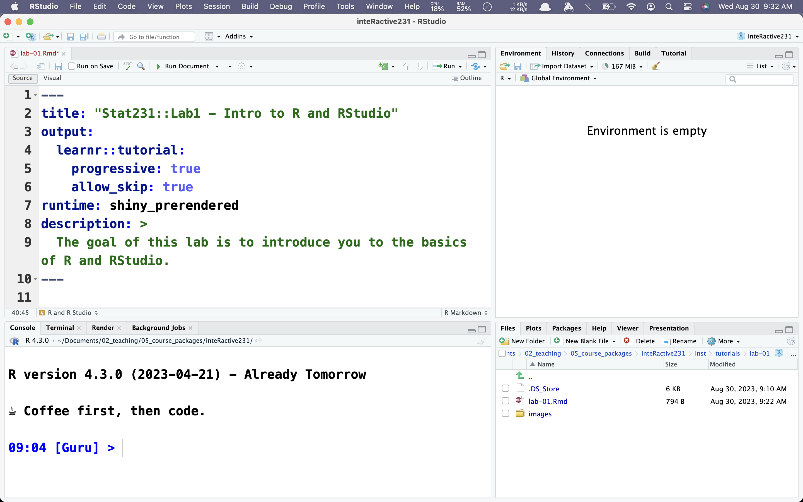
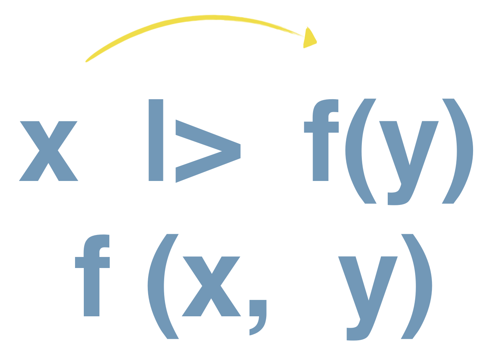

```{r, include = FALSE}
knitr::opts_chunk$set(
  echo = FALSE,
  message = FALSE, 
  warning = FALSE,
  collapse = TRUE,
  comment = "#>")

library(learnr)
library(openintro)
library(dplyr)
library(readr)
library(magrittr)
library(ggplot2)
library(inteRactive231)
```

## Welcome to our first lab day! 
A large majority of statistics is done through with computers, not a pencil and a calculator. To that end, I want to introduce you all to statistical computing via the R programming language. You do not need any prior experience. All of our lessons are follow-along tutorials with example, exercises and solutions! 

We will have five of these throughout the semester. Credit for them is based on following along in class and completion. At the end of each tutorial you will generate a hash code to be submitted on Sakai. This code will show me what you completed. We will walk through that part together at the end of this tutorial. **There will not be any assessments of this material.** 

## R and R Studio
R is a programming language designed around statistical analysis. It is widely used by statisticians and data scientists including those who work at major corporations like Meta and Google. 

RStudio is an Interactive Development Environment or IDE that was originally built for writing code with R. It has since evolved to also have many tools for writing code with Python.

Here is what you should see when you first start up RStudio. 

{width=70%}

### Panes
There are four panes on the screen: editor, environment, console and files.

* Editor: This is where script files are written. 
* Environment: This pane tracks what variables and data sets "exist". It also houses the tutorials, where you are now.
* Console: This is where we can write one-off lines of code. 
* Files: This shows your project structure. It also has *Help*, *Plots* and *Packages* tabs that are highly useful.

## Data in RStudio
In R, data set are referred to as *dataframes*. You can load external data in any format (csv, xlsx, googlesheets, json, etc). Examples of loading in an external data set using the `readr` pacakge is below. 

```{r read-data, eval = FALSE, echo = TRUE}
#Example 1:
data <- readr::read_csv("mydata.csv")

#Example 2:
library(readr)
data <- read_csv("mydata.csv")
```

In the first example, we are picking out the single function we need from the `readr` package. In the second example, we are loading in the entire `readr` package first, then using what we need. 

For this tutorial, we will use the `mariokart` data set from the `openintro` package. You can view the data set below. 

```{r glimpse-data, exercise = TRUE}
glimpse(mariokart)
```

We can gain some insight from the variables, listed on the left, but the help file is almost always more beneficial. 

```{r data-help, exercise = TRUE}
?mariokart
```

Now it is much more clear that this data set is about video game auctions. Next, we'll see how R can calculate summary statistics.  

## Calculating an average

Technically we have not learned about averages yet but I'm assuming you've seen them before. 

To calculate an average, we add together all values of a variable and then divide by the number of values we added together (our *sample size*). 

We can do this two different ways, manually or with built in functions. For example, we'll calculate the average number of bids.

```{r average-bids, echo = TRUE}
# Example 1:
sum(mariokart$n_bids)/nrow(mariokart)

# Example 2:
mariokart |> 
  summarize(mean(n_bids))
```

In the first example, the **sum** function sums together the values of the variable inside. The \$ after `mariokart` tells the computer that we want to pick a variable inside that data set. The **nrow** function counts the number of rows in a given data set. 

In the second example, we "pipe" the data set into the **summarize** function. This function collects all rows in the data set to perform a given operation. In this case, calculating the average of the `n_bids` column. This is commonly refered to as **tidy syntax**. 

The `|>` is a called a pipe-operator. It takes the variable or data frame on the left side and plugs it in to the function on the right side. 

{width=50%}

### Your Turn! 
Calculate the average total price, `total_pr`, using both methods. 
```{r average-price, exercise = TRUE}
# Method 1: 

# Method 2:

```

```{r average-price-hint}
# Method 1:
sum(mariokart$___)/nrow(___)

# Method 2:
mariokart |> 
  summarize(mean(___))
```


```{r average-price-solution}
# Method 1:
sum(mariokart$total_pr)/nrow(mariokart)

# Method 2: 
mariokart |> 
  summarize(mean(total_pr))
```


## Making a graph
One of the graphs that we'll make most often is a histogram. We'll learn about these more in depth next week when we start chapter 2; we'll also cover this code more in depth in a later lab session. Essentially a histogram will give us a visual of the distribution of values for a given variable. 

To create a histogram with R, we'll use the `ggplot2` package. The `gg` stands for "Grammer of Graphics". It allows us to build plots one layer at a time. Again, this will be covered more in depth in a later lab session; today is just a sneak peak of where we're going. 

```{r bids-histogram, exercise = TRUE, eval = TRUE}
ggplot(data = mariokart, mapping = aes(x = n_bids)) + 
  geom_histogram(color = "white")
```

This is what we will eventually call an approximately normal distribution; the peak of the data set is centered and spreads out *roughly* even on either side. Delete `color = "white"` from the above code and rerun it. What changed? 

### Your Turn! 
Create a histogram for the total price, `total_pr`.

```{r price-histogram, exercise = TRUE}


```

```{r price-histogram-hint-1}
ggplot(data = ___, mapping = aes(x = ___)) + 
  geom____(color = ___)
```

```{r price-histogram-hint-2}
ggplot(data = ___, mapping = aes(x = ___)) + 
  geom_histogram(color = ___)
```

```{r price-histogram-solution}
ggplot(data = mariokart, mapping = aes(x = total_pr)) + 
  geom_histogram(color = "white") 

#Note: You could use any color where "white" is.
```

## Submit

Congratulations! You've completed our first lab day! Please enter your name and student ID below, then click `Generate`. Copy/paste the hash code into your submission on Sakai. 

```{r, echo=FALSE, context = "server"}
encoder_logic()
```

```{r encode, echo=FALSE}
learnrhash::encoder_ui(ui_before = hash_encoder_ui())
```
